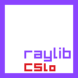

<h1 align="center">
    <a href="#"> Raylib-CsLo</a>
     
</h1>

# Raylib-CsLo
LowLevel autogen bindings to Raylib 4.0 and convenience wrappers on top.  

- Requires use of `unsafe`
- Requires use of `DotNet 6.0`
- A focus on performance.  No runtime allocations if at all possible.
- because these are autogen, there won't be any intellisense docs. [read the raylib cheatsheet for docs](https://www.raylib.com/cheatsheet/cheatsheet.html)

# Table of Contents

- [Raylib-CsLo](#raylib-cslo)
- [Table of Contents](#table-of-contents)
- [🚧🚨🚧 UNDER CONSTRUCTION 🚧🚨🚧](#-under-construction-)
  - [Release timeline](#release-timeline)
    - [`BETA`](#beta)
    - [`RELEASE`](#release)
- [Differences from `raylib-cs`](#differences-from-raylib-cs)
- [Usage Tips / FAQ](#usage-tips--faq)
- [How to Contribute](#how-to-contribute)
- [ChangeLog](#changelog)

# 🚧🚨🚧 UNDER CONSTRUCTION 🚧🚨🚧
The entire API of `Raylib 4.0` is available via these bindings.  However, as the bindings are auto-generated, they are not user friendly, even for `unsafe` use.

To make these bindings "friendly" to C# use, convenience wrappers are being added, so you can use these bindings with a minimal amount of `unsafe` code.

The current mission of this project is to port all Raylib examples (more than 120 of them) to work with these bindings, with as little modification to the example code as possible.  In doing so, convenience wrappers will be added for the Raylib api's used in the examples.  This is a good heuristic for "primary usage scenarios", so writing wrappers for these API's should make these bindings user friendly in the fastest time, while also providing valuable C# examples.

Right now the [Core, Model, and Shader examples have been fully ported](https://github.com/NotNotTech/Raylib-CsLo/tree/main/Raylib-CsLo.Examples).

## Release timeline

### `BETA`
- **The current status.**
- Triggered when the `model` and `shaders` examples are ported. 
- [A Nuget package is avalable](https://www.nuget.org/packages/Raylib-CsLo)
- `Core`, `Model`, and `Shader` examples are ported.

### `RELEASE`
- Triggered when all remaining examples are ported.  You can contribute to make this happen.

# Differences from `raylib-cs`

| [`raylib-cs`](https://github.com/ChrisDill/Raylib-cs)                   | `raylib-cslo`                                                                                                                                                                         |
| ----------------------------------------------------------------------- | ------------------------------------------------------------------------------------------------------------------------------------------------------------------------------------- |
| each binding is hand crafted with carefull design                       | Autogen with wrappers to make the raylib examples work (with minimal changes).  Bindings not used in examples will probably be painful to use (example: convert `sbyte*` to strings). |
| Optimized for normal C# usage                                           | Optimized for maximum performance and requires `unsafe`                                                                                                                               |
| New Raylib version? Harder to detect breaking changes                   | New Raylib version? Breaking changes are easy to spot and fix                                                                                                                         |
| includes Intellisence docs                                              | No docs.  Use the [Cheatsheet](https://www.raylib.com/cheatsheet/cheatsheet.html)                                                                                                     |
| has a long track record                                                 | didn't exist till mid november 2021!                                                                                                                                                  |
| [has lots of examples](https://github.com/ChrisDill/Raylib-cs-Examples) | [only the Core examples](https://github.com/NotNotTech/Raylib-CsLo/tree/main/Raylib-CsLo.Examples)                                                                                    |
| zlib licensed                                                           | lgpl licensed                                                                                                                                                                         |
| [Nuget Package](https://www.nuget.org/packages/Raylib-cs/)              | [Nuget Package](https://www.nuget.org/packages/Raylib-CsLo)                                                                                                                           |
| Stable                                                                  | Alpha                                                                                                                                                                                 |
| Works with various dotnet flavors?                                      | Focus on DotNet6.0                                                                                                                                                                    |
| lots of contribs                                                        | just little 'ol me                                                                                                                                                                    |

# Usage Tips / FAQ
- **Does `Raylib-CsLo` include the `SOME_FUNCTION_YOU_NEED()` function?**
  - Raylib-CsLo has bindings for everything in the Raylib 4.0 release, with the exception of:
    -  Native Memory allocation functions:  use `System.Runtime.InteropServices.NativeMemory.Alloc()` instead
    -  `LogCustom()` is ported but doesn't support variable length arguments.
- **Why didn't you add a wrapper for function `SOME_OTHER_FUNCTION_YOU_NEED()`?** 
  - Raylib-CsLo uses a manual marshalling technique, as the built in PInvoke marshalling is not very efficienct.  Unfortunately writing wrappers takes time.
  - I am going through all the examples and porting them, and when I do I'm adding wrappers to the raylib api's used (I'm using examples as a heuristic for "commonly used api's)   For a function I haven't written a wrapper for, you can look at how I do it and write your own wrapper, or can help the project by submitting a PR.  
  - On average it only takes me about 15 min to port each example, but there are many examples.
- **How do I convert a string to `sbyte*` or vice-versa?**
  - Look if there is a wrapper overload you can call.  If not, you can write your own wrapper by coppying the pattern in one of the existing wrappers.
- **Do I have to really cast my Enum to `int`?**
  -  The autogen bindings are left untouched, however convenience wrappers are added.  Usually these will automagically "work" via function overloads, but where this is not possible, try adding an underscore `_` to the end of the function/property.  For example:  `Camera3D.projection_ = CameraProjection.CAMERA_ORTHOGRAPHIC;` or `Gesture gesture = Raylib.GetGestureDetected_();`
- **I ran the examples in a profiler.   What are all these `sbyte[]` arrays being allocated?**
   -  A pool of `sbyte[]` is allocated for string marshall purposes, to avoid runtime allocations.
- **Why don't you add wrappers for the Math helpers?**
  - The `RayMath` helper functions have been translated into C# code.   This is because crossing between Managed and Native code isn't free.  Better you do all your maths in managed code, and pass the final result to raylib.
- **Why are my matricies corrupt?**
  - Raylib/OpenGl uses column-major matricies, while dotnet/vulkan/directx uses row-major.  When passing your final calculated matrix to raylib for rendering, call `Matrix4x4.Transpose(yourMatrix)`

# How to Contribute

0) assume you are using Visual Studio (or maybe rider?) and can run `dev.sln`
1) fork the repo, build and try out the example project
2) Look at how a lot of the raylib functions used in the core examples have convenience wrappers.
3) Pick one of the raylib example groups not being worked on, and let novaleaf know either on discord or via an [issue](https://github.com/NotNotTech/Raylib-CsLo/issues)
4) port the example group, following the general design as the core examples.

| ~ example group ~ | ~ who is doing port ~ | ~ done? ~ |
| ----------------- | --------------------- | --------- |
| core              | novaleaf              | [X]       |
| shapes            |                       | [ ]       |
| textures          |                       | [ ]       |
| text              |                       | [ ]       |
| models            | novaleaf              | [X]       |
| shaders           | novaleaf              | [X]       |
| audio             |                       | [ ]       |
| physics           |                       | [ ]       |

# ChangeLog
- **4.0.0-beta.0** (2021/11/20):  `Model`, and `Shader` examples ported. 
- **4.0.0-alpha.2** (2021/11/18):  Model examples ported. AutoGen Bindings expanded to include all api's exposed by Raylib.dll (adding `RayMath`, `RlGl`, `RayGui`)
- **4.0.0-alpha.1** (2021/11/16):  all `Core` examples ported, so "feature complete" for the workflows used in those examples (and, complete only for those workflows)
